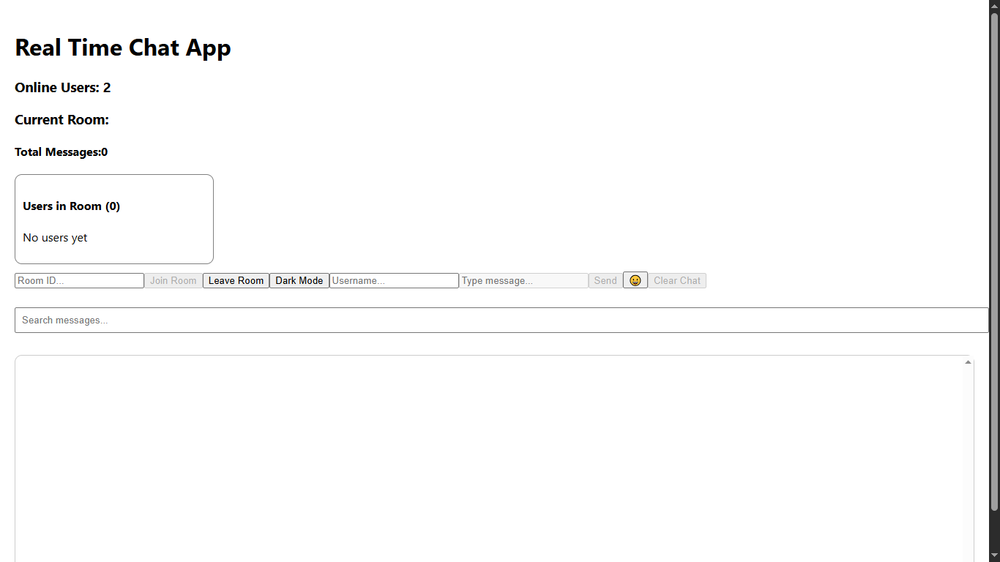
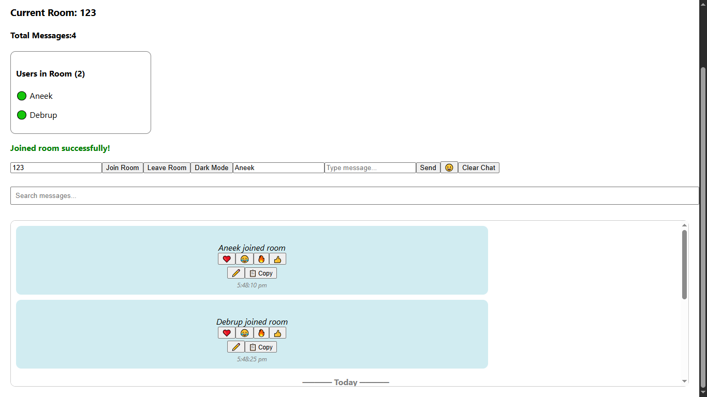
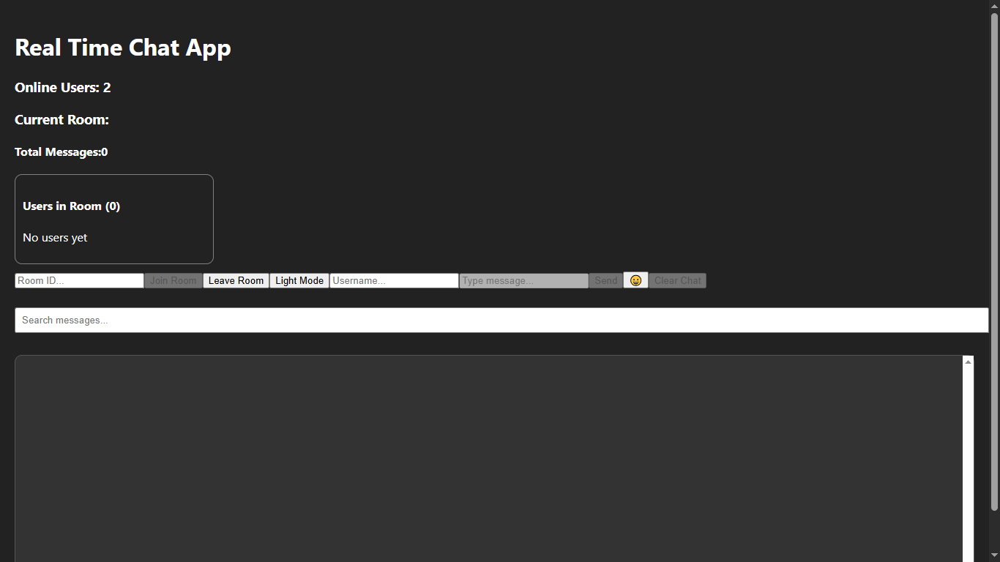
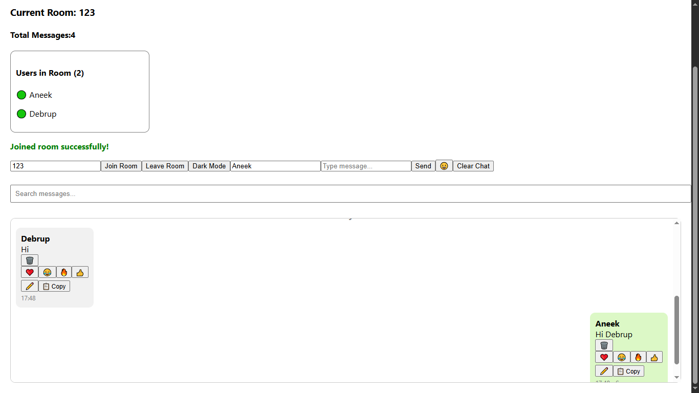

Real Time Chat App

A real-time chat application built using React.js and Socket.IO.

Features

- Real-time messaging
- Join and leave rooms
- Online user count
- Room user list
- Typing indicator
- Chat history
- Search messages
- Dark mode
- Emoji picker
- Copy messages
- Edit messages
- Delete messages
- Clear room chat
- Seen receipts

Tech Stack

- React.js
- Node.js
- Express.js
- Socket.IO

Installation

Client

npm install

npm start

Server

npm install

node server.js

Future Improvements

- Message reactions
- Image sharing
- Authentication
- MongoDB storage
- Private messaging

Screenshots

Home Screen

Chat Room

Dark Mode

typing Indicator

